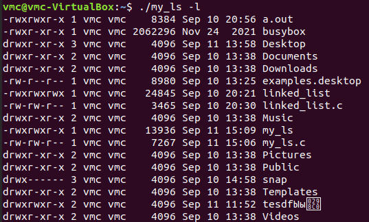
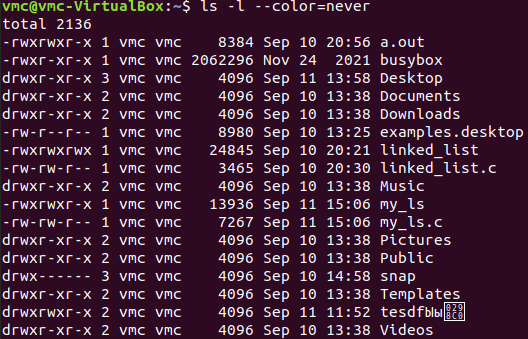
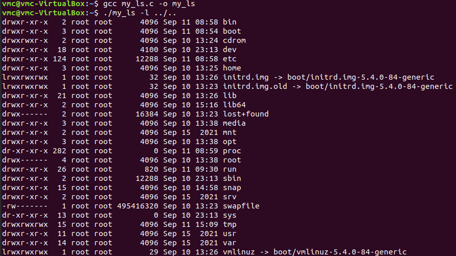
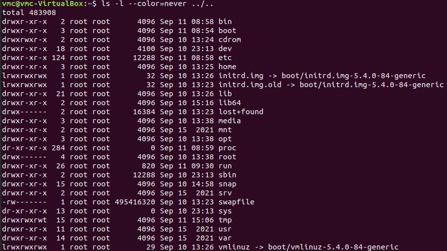

# Answer to a test tasks into A*-company

You may download *bin*-file from **release** section.

## Linked list
Need to find problems in the code

See `linked_list.c`

## ls-utility
Develop own version of ls-utility. Only the 'ls -l' functionality is worked.

See `my_ls.c`. 

Result of the program compare with original `ls`:

